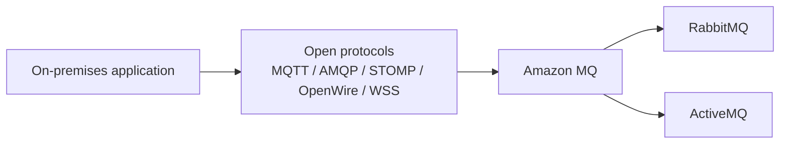

# 94. Amazon MQ

## 🎯 Giới thiệu
- **Amazon MQ** là một **managed message broker service**.
- Dùng khi bạn đang migrate ứng dụng từ on-premises và **không muốn re-engineer** sang các API/protocol của **SQS** hoặc **SNS**.
- Hỗ trợ các **open protocols** thường gặp như:
  - **MQTT**
  - **AMQP**
  - **STOMP**
  - **OpenWire**
  - **WSS**
- Amazon MQ cung cấp managed versions của hai công nghệ:
  - **RabbitMQ**
  - **ActiveMQ**

## 1. Vì sao dùng Amazon MQ
- **SQS** và **SNS** là cloud-native services, dùng các API/protocol riêng của AWS.
- Nếu ứng dụng cũ đang dùng protocol truyền thống, Amazon MQ giúp giữ nguyên cách giao tiếp hiện tại.
- Phù hợp cho bài toán **migration** hơn là thiết kế cloud-native mới từ đầu.

## 2. Đặc điểm chính
- Amazon MQ **không scale lớn như SQS hoặc SNS**.
- Vì chạy trên **servers**, nên có thể gặp **server issues**.
- Nếu cần high availability, có thể dùng **Multi-AZ setup** với **failover**.
- Amazon MQ có cả:
  - **Queue feature** → giống **SQS**
  - **Topic feature** → giống **SNS**
- Cả hai feature này nằm trong **single broker**.

## 3. Tình huống migrate phù hợp
- Có thể migrate từ:
  - **IBM MQ**
  - **TIBCO EMS**
  - **RabbitMQ**
  - **Apache ActiveMQ**
- Lý do là nhờ **protocol compatibility**.
- Ví dụ được nhắc tới: có thể migrate từ **IBM WebSphere MQ** sang AWS bằng cách dùng **Amazon MQ** thay vì IBM WebSphere MQ.

## 📊 Bảng tóm tắt
| Tiêu chí | Mô tả |
|----------|------|
| Dịch vụ | Managed message broker service |
| Công nghệ hỗ trợ | RabbitMQ, ActiveMQ |
| Protocol | MQTT, AMQP, STOMP, OpenWire, WSS |
| Mục đích chính | Migration ứng dụng on-premises lên cloud |
| So với SQS/SNS | Không scale mạnh bằng, nhưng phù hợp khi cần giữ protocol cũ |
| High Availability | Có thể dùng Multi-AZ setup với failover |
| Tính năng | Có cả queue và topic trong một broker |

## 💡 Mẹo ghi nhớ cho kỳ thi AWS
- Nhớ rằng **Amazon MQ** dành cho **legacy / on-premises messaging** khi bạn muốn giữ **protocol cũ**.
- Nếu đề bài nói đến **RabbitMQ**, **ActiveMQ**, **IBM MQ**, hoặc **TIBCO EMS**, hãy nghĩ ngay đến **Amazon MQ**.
- Nếu câu hỏi nhấn mạnh **queue + topic trong cùng một broker**, đó cũng là dấu hiệu của **Amazon MQ**.
- Nếu mục tiêu là **scale cực lớn**, transcript nhấn mạnh rằng Amazon MQ **không scale như SQS/SNS**.

## ✅ Kết luận
- **Amazon MQ** là lựa chọn cho bài toán **migrate messaging systems** truyền thống lên AWS mà vẫn giữ được **open protocols**.
- Dịch vụ này đặc biệt phù hợp khi bạn cần **RabbitMQ/ActiveMQ compatibility**, có thể triển khai **Multi-AZ** để tăng tính sẵn sàng, và muốn có cả **queue** lẫn **topic** trong một broker.
