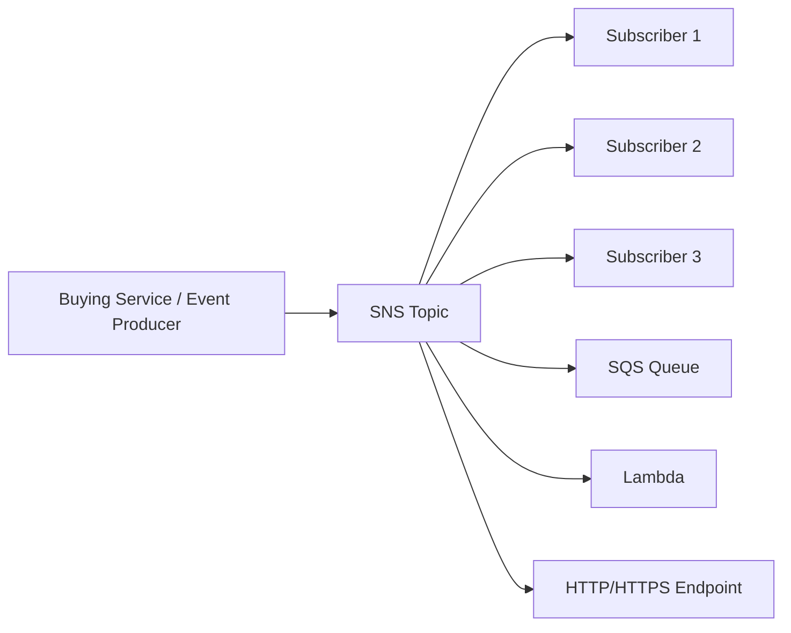

# 95. Amazon SNS

## 🎯 Giới thiệu
Amazon SNS (Simple Notification Service) là dịch vụ theo mô hình **Pub/Sub (Publish-subscribe)**, dùng khi bạn muốn **gửi 1 message đến nhiều bên nhận**.

- Thay vì tích hợp trực tiếp từng service với nhau, bạn chỉ cần publish vào **1 SNS topic**
- Các **subscribers** sẽ tự động nhận message từ topic đó
- Đây là cách làm phù hợp hơn so với việc phải viết riêng integration cho từng receiver mới

## 1. Pub/Sub và cơ chế hoạt động
Trong Amazon SNS:

- **Event producer** chỉ gửi message đến **1 SNS topic**
- **Event receivers / subscriptions** lắng nghe notifications từ topic đó
- Mỗi subscriber sẽ nhận tất cả message gửi đến topic
- Có thể dùng **message filtering** để lọc message cho từng subscriber

### Cách hoạt động chính
- Tạo **SNS topic**
- Tạo **subscriptions**
- Publish message vào topic
- SNS tự động phân phối message đến các subscribers

### Số lượng
- Có thể có tới **12,000,000+ subscriptions per topic**
- Trong account có thể có tới **100,000 topics**
- Các con số này có thể thay đổi, nhưng transcript nhấn mạnh rằng **không bị kiểm tra chi tiết về limits**

## 2. Các kiểu subscriber và tích hợp
SNS có thể gửi message đến nhiều loại đích khác nhau:

- **Email**
- **SMS**
- **Mobile notifications**
- **HTTP / HTTPS endpoints**
- **SQS**
- **Lambda**
- **Kinesis Data Firehose**

### SNS cũng nhận notification từ nhiều AWS services
Các dịch vụ có thể publish event vào SNS topic, ví dụ:

- **CloudWatch Alarms**
- **Auto Scaling Group notifications**
- **CloudFormation state changes**
- **Budgets**
- **S3 buckets**
- **DMS**
- **Lambda**
- **DynamoDB**
- **RDS events**
- Và nhiều dịch vụ khác

### Mobile app flow
Với mobile apps, có cơ chế **direct publish**:

- Tạo **platform application**
- Tạo **platform endpoint**
- Publish vào platform endpoint
- Hỗ trợ các hệ thống subscriber như:
  - **Google GCM**
  - **Apple APNS**
  - **Amazon ADM**

## 3. Bảo mật và kiểm soát truy cập
SNS có mô hình bảo mật tương tự SQS:

- **In-flight encryption** mặc định
- **At-rest encryption** bằng **KMS keys**
- **Client-side encryption** nếu client tự mã hóa message trước khi gửi

### Access control
- **IAM policies** là trung tâm của bảo mật
- Tất cả SNS APIs đều được điều khiển bởi IAM policies
- SNS còn có **SNS access policies**
  - Tương tự **S3 bucket policies**
  - Hữu ích cho:
    - **Cross-account access** đến SNS topics
    - Cho phép dịch vụ khác như **S3 events** ghi vào SNS topic

## 📊 Bảng tóm tắt
| Tiêu chí | Mô tả |
|----------|------|
| Mô hình | **Pub/Sub** |
| Vai trò chính | Producer publish vào **SNS topic**, subscribers nhận message |
| Điểm mạnh | Gửi 1 message đến nhiều receiver, tránh tích hợp trực tiếp phức tạp |
| Subscriber hỗ trợ | Email, SMS, mobile notifications, HTTP/HTTPS, SQS, Lambda, Kinesis Data Firehose |
| Dữ liệu đầu vào | Có thể nhận notification từ nhiều AWS services như CloudWatch, S3, Lambda, DynamoDB, RDS... |
| Mobile publish | Dùng **platform application** và **platform endpoint** |
| Bảo mật | In-flight encryption, at-rest encryption với **KMS**, client-side encryption |
| Access control | **IAM policies** và **SNS access policies** |

## 💡 Mẹo ghi nhớ cho kỳ thi AWS
- Nhớ SNS = **Publish 1 lần, fan-out nhiều nơi**
- Nếu đề bài nói **nhiều receiver**, **notification**, **fan-out**, hãy nghĩ đến **SNS**
- Nếu cần gửi message đến:
  - **SQS**
  - **Lambda**
  - **HTTP/HTTPS**
  - **Email/SMS**
  thì SNS là lựa chọn phù hợp
- Khi thấy nhắc đến **IAM policies** và **SNS access policies**, hãy nhớ đây là phần kiểm soát truy cập của SNS
- Với luồng sự kiện từ AWS services đi ra notification, SNS thường là điểm nhận trung tâm

## ✅ Kết luận
Amazon SNS là dịch vụ **Pub/Sub** dùng để publish message vào một **topic** và phân phối tự động đến nhiều **subscribers**. Nó hỗ trợ nhiều đích nhận, tích hợp tốt với nhiều AWS services, có cơ chế bảo mật bằng **IAM**, **KMS**, và **SNS access policies**, rất quan trọng cho việc học và ôn thi AWS.
