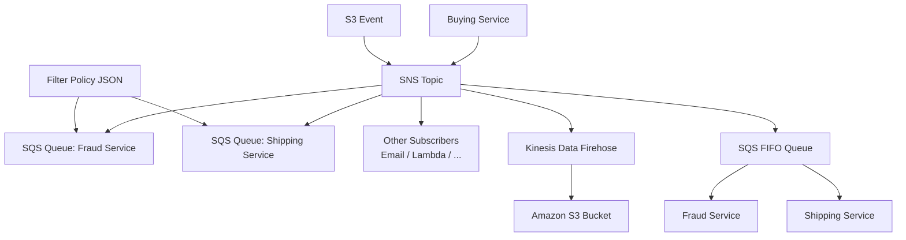

# 96. Amazon SNS - SQS Fan Out Pattern

## 🎯 Giới thiệu
- **SNS + SQS fan-out pattern** là cách gửi **1 message** vào **SNS topic** rồi cho **nhiều SQS queues** subscribe để nhận cùng một message.
- Mục tiêu là tránh gửi riêng lẻ đến từng queue, vì cách đó có thể gặp:
  - application crash giữa chừng
  - delivery failures
  - khó mở rộng khi thêm SQS queues mới sau này
- Mẫu này giúp hệ thống:
  - **fully decoupled**
  - **no data loss**
  - tận dụng **SQS persistence**, **delayed processing**, và **retries**

## 1. Fan-out cơ bản giữa SNS và nhiều SQS queues
- Producer chỉ cần **push 1 lần vào SNS topic**.
- Nhiều **SQS queues** subscribe vào topic và cùng nhận message.
- Ví dụ:
  - **Buying service** gửi message vào **SNS topic**
  - **Fraud service** đọc từ queue riêng
  - **Shipping service** đọc từ queue riêng
- Lợi ích chính:
  - giảm phụ thuộc giữa các service
  - dễ mở rộng thêm queue/subscriber theo thời gian
- Cần lưu ý:
  - **SQS queue access policy** phải cho phép **SNS topic** ghi vào queue
  - có thể có **cross-region delivery** nếu security cho phép

## 2. Các biến thể của fan-out pattern
- **S3 events → SNS → nhiều destinations**
  - Dùng khi muốn cùng một **S3 event notification** đi đến nhiều nơi.
  - Đặc biệt hữu ích vì với một cặp **event type + prefix** của S3, chỉ có thể có **one S3 event rule**.
  - SNS có thể fan-out đến:
    - nhiều **SQS queues**
    - **email**
    - **Lambda functions**
    - các destination khác
- **SNS → Kinesis Data Firehose → S3**
  - SNS có **direct integration** với **Kinesis Data Firehose (KDF)**.
  - Flow:
    - buying service gửi data vào **SNS topic**
    - **KDF** nhận data
    - từ KDF, data đi vào **Amazon S3 bucket** hoặc destination được hỗ trợ
  - Mẫu này giúp linh hoạt hơn khi muốn persist message từ SNS.

## 3. SNS FIFO, ordering, deduplication và message filtering
- **SNS FIFO** dùng khi cần:
  - **fan-out**
  - **ordering**
  - **deduplication**
- Tính chất chính:
  - message đi theo thứ tự như **1, 2, 3, 4**
  - có **ordering by message group ID**
  - có **deduplication** bằng:
    - **deduplication ID**
    - hoặc **content-based deduplication**
- Throughput:
  - bị giới hạn theo throughput của **SQS FIFO queue**
- Use case điển hình:
  - buying service gửi vào **SNS FIFO topic**
  - fan-out sang **2 SQS FIFO queues**
  - fraud service và shipping service đọc message theo thứ tự
- **Message filtering** trong SNS:
  - là **JSON policy** dùng để lọc message ở subscription
  - nếu subscription **không có filter policy** thì mặc định nhận **tất cả message**
  - có thể lọc theo trạng thái, ví dụ:
    - `State = Placed` cho queue xử lý order placed
    - `State = Canceled` cho queue xử lý order canceled
  - có thể dùng cùng một filter policy cho:
    - **SQS queue**
    - **email subscription**
  - cũng có thể tạo một queue **không có filter policy** để nhận toàn bộ message

## 📊 Bảng tóm tắt
| Tiêu chí | Mô tả |
|----------|------|
| Mục tiêu | Gửi 1 message từ SNS đến nhiều subscriber |
| Thành phần chính | SNS topic, SQS queues, optional Email/Lambda/KDF |
| Lợi ích | Decoupled, no data loss, dễ mở rộng, hỗ trợ persistence/retries |
| Điều kiện | SQS queue access policy phải cho phép SNS ghi vào queue |
| Cross-region | Có thể gửi sang SQS queues ở region khác nếu security cho phép |
| Mở rộng từ S3 | Dùng SNS để fan-out S3 events đến nhiều đích |
| KDF integration | SNS có thể đẩy sang Kinesis Data Firehose rồi tới S3 |
| SNS FIFO | Hỗ trợ ordering, deduplication, dùng khi cần fan-out kiểu FIFO |
| Message filtering | JSON policy lọc message theo subscription |
| Exam focus | Fan-out, FIFO, filter policy, cross-region, access policy |

## 💡 Mẹo ghi nhớ cho kỳ thi AWS
- **SNS = 1 lần publish, nhiều subscriber nhận**
- **SQS = nơi từng service tự đọc message của mình**
- **Fan-out = decouple + no data loss + dễ thêm subscriber**
- Nhớ kiểm tra **SQS queue access policy** khi SNS ghi vào queue
- Nếu đề bài nói:
  - **nhiều queue nhận cùng event**
  - **S3 event đi nhiều nơi**
  - **lọc message theo điều kiện**
  - **ordering + deduplication**
  thì nghĩ ngay đến **SNS fan-out**, **SNS FIFO**, hoặc **SNS message filtering**
- Với bài thi, rất dễ bị hỏi về:
  - **cross-region delivery**
  - **S3 event rule limitation**
  - **filter policy JSON**
  - **FIFO fan-out**

## ✅ Kết luận
- **SNS + SQS fan-out pattern** là cách chuẩn để phân phối cùng một message tới nhiều đích một cách **decoupled** và **an toàn**.
- Pattern này mở rộng tốt cho:
  - **multiple SQS queues**
  - **S3 events**
  - **Kinesis Data Firehose**
  - **FIFO ordering**
  - **message filtering**
- Đây là một chủ đề quan trọng trong AWS exam vì có nhiều biến thể và dễ bị hỏi về flow, policy, và use case thực tế.
