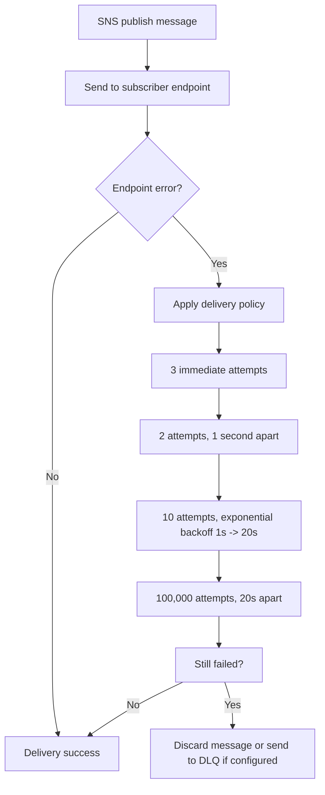

# 97. Amazon SNS - Message Delivery Retries

## 🎯 Giới thiệu
- Chủ đề này nói về cách **Amazon SNS** xử lý **Message Delivery Retries** và **SNS Dead Letter Queues (DLQ)** khi việc gửi message tới subscriber gặp lỗi phía service hoặc endpoint.
- Ý chính:
  - SNS có **delivery policy** để retry.
  - Một số **AWS managed endpoints** có cơ chế retry cố định.
  - **HTTP endpoint** là loại hỗ trợ **custom delivery policy**.
  - Khi retry hết mà vẫn thất bại, có thể đẩy message vào **Dead Letter Queue** nếu được cấu hình.

## 1. 🔁 Message Delivery Retries trong SNS
- Khi SNS gửi message cho subscriber mà endpoint gặp lỗi, SNS sẽ áp dụng **delivery policy**.
- Với các **AWS managed endpoints** như **Firehose**, **Lambda**, **SQS**:
  - Có các giai đoạn retry cố định.
  - Tổng số lần thử rất lớn, lên tới **over 100,015 times** trong khoảng **23 days**.
- Các giai đoạn retry được mô tả như sau:
  - **Immediately**: thử **3 lần** không delay, không retry wait.
  - **Pre-backup phase**: thử **2 lần**, cách nhau **1 second**.
  - **Backup phase**: thử **10 lần** với **exponential backoff** từ **1 second** đến **20 seconds**.
  - **Post-backup phase**: thử **100,000 lần**, mỗi lần cách **20 seconds**.
- Ngoài ra còn có cơ chế tương tự cho **SMTP**.
- Ý nghĩa ôn thi:
  - SNS không chỉ thử một vài lần, mà có thể retry rất nhiều lần trước khi bỏ cuộc.

## 2. ⚙️ Custom Delivery Policy cho HTTP endpoint
- Nếu subscriber là **HTTP endpoint**, SNS hỗ trợ **custom policies**.
- Có thể tùy chỉnh các tham số như:
  - **number of retry**
  - **min delay**
  - **max delay**
  - **backoff function**
  - **throttle policy**
- Mục đích:
  - Điều chỉnh cách SNS retry để phù hợp với backend.
  - Tránh gây **heavy load** hoặc quá nhiều retry lên hệ thống đích.
- Điểm cần nhớ:
  - Đây là **only kind of delivery mechanism** trong bài nói đến mà **supports a custom delivery policy**.

## 3. 🪣 Dead Letter Queue (DLQ) cho SNS
- Nếu SNS đã **exhausted the delivery policy** mà vẫn không gửi được message:
  - Message sẽ bị **discarded**,
  - **unless** bạn cấu hình **Dead Letter Queue (DLQ)**.
- DLQ của SNS:
  - Là **SQS queue** hoặc **SQS FIFO queue** nếu dùng **SNS FIFO**.
  - **Attached to a subscription, not to a topic**.
- Nghĩa là:
  - Mỗi subscription có thể có DLQ riêng.
  - Ví dụ:
    - một **email subscription** có thể có một DLQ,
    - một **HTTP subscription** có thể có một DLQ khác.
- Mục đích:
  - Giữ lại các message thất bại để có thể xử lý sau.
  - Tránh mất message khi delivery không thành công.

## 📊 Bảng tóm tắt
| Tiêu chí | Mô tả |
|----------|------|
| Cơ chế retry | SNS áp dụng **delivery policy** khi endpoint gặp lỗi |
| AWS managed endpoints | Có retry cố định với nhiều giai đoạn và số lần thử rất lớn |
| HTTP endpoint | Hỗ trợ **custom delivery policy** |
| Tham số tùy chỉnh | **retry count**, **min/max delay**, **backoff function**, **throttle policy** |
| DLQ trong SNS | Dùng **SQS** hoặc **SQS FIFO** (với **SNS FIFO**) |
| Vị trí gắn DLQ | Gắn vào **subscription**, không gắn vào **topic** |
| Khi hết retry | Message bị discard, trừ khi có DLQ |
| Điểm nhớ khi thi | **HTTP subscription** là nơi hỗ trợ custom retry policy |

## 💡 Mẹo ghi nhớ cho kỳ thi AWS
- 🧠 Nhớ câu: **“SNS retries nhiều lần trước khi bỏ, và DLQ gắn vào subscription.”**
- 🔑 **HTTP endpoint** là chỗ có thể set **custom delivery policy**.
- 🔑 **DLQ không gắn vào topic** mà gắn vào **subscription**.
- 🔑 Nếu dùng **SNS FIFO**, DLQ có thể là **SQS FIFO queue**.
- 🔑 AWS managed endpoints có retry rất dài, tổng cộng **over 100,015 attempts** trong **23 days** theo transcript.

## ✅ Kết luận
- **Amazon SNS** có cơ chế **Message Delivery Retries** mạnh mẽ để cố gắng gửi message thành công qua nhiều giai đoạn retry.
- **HTTP endpoint** cho phép cấu hình **custom delivery policy** linh hoạt hơn.
- Khi mọi retry đều thất bại, **Dead Letter Queue** giúp giữ lại message lỗi để xử lý sau, và DLQ được **attach vào subscription**.
